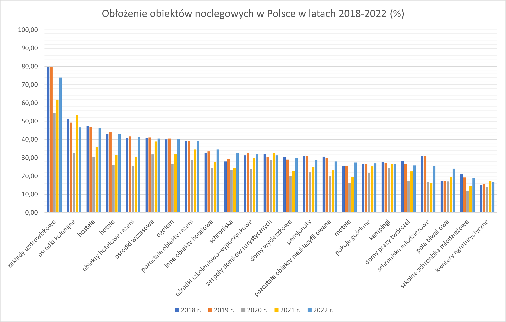
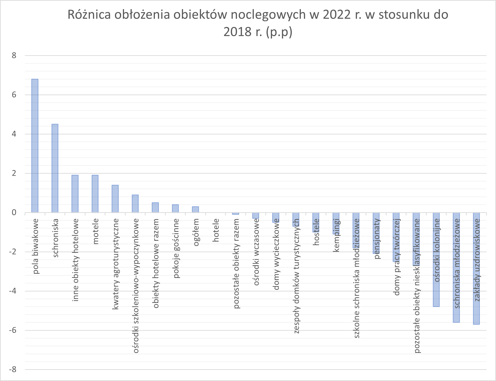
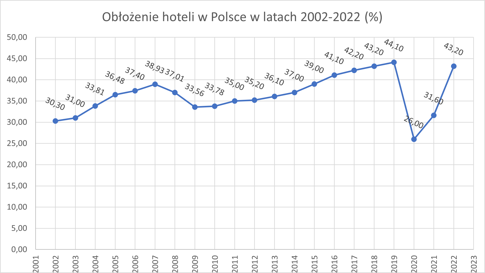
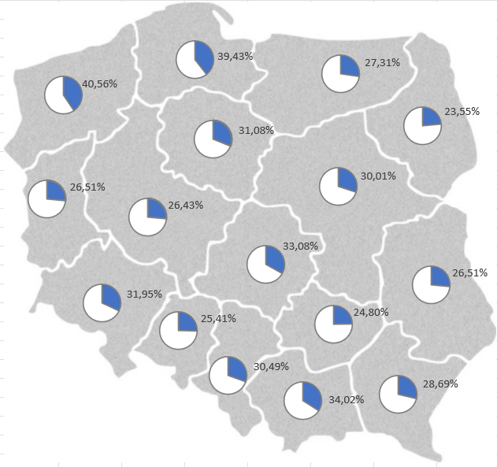

# SQL Projekt - Miejsca noclegowe w Polsce

Analiza danych statystycznych dotyczących bazy noclegowej w Polsce.


## Metodologia

Skompilowanie danych statystycznych Głównego Urzędu Statystycznego dostępnych na stronei www.stat.gov.pl i wysłanie zapytań do bazy danych w programie pgAdmin 4 (PostgresSQL) w celu przeprowadzenia poniższej analizy;

## Główny cel

1. Wymienienie obłożenia hoteli w Polsce w 2022 r. 
2. Zestawienie obłożenia obiektów noclegowych w Polsce według rodzaju w latach 2018-2022.    
3. Obliczenie różnicy w obłożeniu obiektów noclegowych w Polsce w 2022 r. w porównaniu do 2018 r.
4. Wymienienie obłożenia wszystkich hoteli w Polsce w latach 2002 - 2022.  
5. Wyróżnienie najmniejszego i największego obłożenia hoteli w Polsce w latach 2002 - 2022.  
6. Zestawienie wykorzystania miejsc noclegowych w poszczególnych regionachwojewództwach w 2022 r.  
7. Wyróżnienie rodzaju udogodnień, które są najczęściej spotykane w miejscach noclegowych i porównanie procentowe  odwyniku z 2021 r. do 2009 r. 


## Tworzenie bazydanych 

```
CREATE DATABASE miejsca_noclegowe_w_polsce
    WITH
    OWNER = postgres
    ENCODING = 'UTF8'
    CONNECTION LIMIT = -1
    IS_TEMPLATE = False;
```

## Tworzenie i kopiowanie tabel

#### Tabela 1. "stopień wykorzystania miejsc noclegowych"
```
CREATE TABLE st_wykorzystania_miejsc_noclegowych(
	kod varchar(10),
	nazwa varchar(30),
	rodzaje_obiektow varchar(100),
	rok INTEGER,
	wartosc decimal(5,2),
	jednostka_miary varchar(10),
	atrybut varchar(10)
);

COPY st_wykorzystania_miejsc_noclegowych
FROM '<ROOT_PATH>\dane\st_wykorzystania_miejsc_noclegowych.txt'
WITH (FORMAT CSV, HEADER,DELIMITER ';');
```
#### Tabela 2. "placówki gastronomiczne"
```
CREATE TABLE placowki_gastronomiczne(
		kod varchar(10),
		nazwa varchar(30),
		rodzaje_obiektow varchar(100),
		rodzaje_placowek varchar(100),
		rok INTEGER,
		wartosc INTEGER,
		jednostka_miary varchar(10),
		atrybut varchar(10)
	);

COPY placowki_gastronomiczne
FROM '<ROOT_PATH>\dane\placowki_gastronomiczne.txt'
WITH (FORMAT CSV, HEADER,DELIMITER ';');
```
#### Tabela 3. "obiekty z zapleczem sportowo rekreacyjnym"
```
CREATE TABLE obiekty_z_zapleczem_sportowo_rekreacyjnym(
		kod varchar(10),
		nazwa varchar(30),
		rodzaje_urzadzen varchar(100),
		rok INTEGER,
		wartosc INTEGER,
		jednostka_miary varchar(10),
		atrybut varchar(10)
	);

COPY obiekty_z_zapleczem_sportowo_rekreacyjnym
FROM '<ROOT_PATH>\dane\obiekty_z_zapleczem_sportowo_rekreacyjnym.txt'
WITH (FORMAT CSV, HEADER,DELIMITER ';');

```
#### Tabela 4. "obiekty z udogodnieniem dla niepełnosprawnych"
```
CREATE TABLE obiekty_z_udogodnieniem_dla_niepelnosprawnych(
		kod varchar(10),
		nazwa varchar(30),
		rodzaje_udogodnien varchar(100),
		rok INTEGER,
		wartosc INTEGER,
		jednostka_miary varchar(10),
		atrybut varchar(10)
	);

COPY obiekty_z_udogodnieniem_dla_niepelnosprawnych
FROM '<ROOT_PATH>\dane\obiekty_z_udogodnieniem_dla_niepelnosprawnych.txt'
WITH (FORMAT CSV, HEADER,DELIMITER ';');
```
#### Tabela 5. "obiekty z zapleczem konferencyjnym"
```
CREATE TABLE obiekty_z_zapleczem_konferencyjnym(
		kod varchar(10),
		nazwa varchar(30),
		zaplecze_konferencyjne varchar(100),
		rok INTEGER,
		wartosc INTEGER,
		jednostka_miary varchar(10),
		atrybut varchar(10)
	);

COPY obiekty_z_zapleczem_konferencyjnym
FROM '<ROOT_PATH>\dane\obiekty_z_zapleczem_konferencyjnym.txt'
WITH (FORMAT CSV, HEADER,DELIMITER ';');
```
#### Tabela 6. "stopień wykorzystania hoteli"
```
CREATE TABLE st_wykorzystania_hoteli(
		kod varchar(10),
		nazwa varchar(30),
		wyszczegolnienie varchar(100),
		kategorie varchar(100),
		rok INTEGER,
		wartosc decimal(5,2),
		jednostka_miary varchar(10),
		atrybut varchar(10)
	);

COPY st_wykorzystania_hoteli
FROM '<ROOT_PATH>\dane\st_wykorzystania_hoteli.txt'
WITH (FORMAT CSV, HEADER,DELIMITER ';');
```

# Tworzenie zapytań

## Wybieranie informacji z tabel
### 1. Wykaz obłożenia miejsc noclegowych w hotelach w Polsce w 2022 r. 

```
SELECT DISTINCT rodzaje_obiektow
FROM st_wykorzystania_miejsc_noclegowych;

SELECT rodzaje_obiektow, wartosc AS "oblozenie_%_2022"
FROM st_wykorzystania_miejsc_noclegowych
WHERE nazwa = 'POLSKA' AND rok = 2022
ORDER BY wartosc DESC NULLS LAST;
```
#### wynik:
|    |rodzaje_obiektow        |  oblozenie_%_2022  |
|----|------------------------|--------------------|
|1   |zakłady uzdrowiskowe    |73.90               |
|2   |ośrodki kolonijne       |46.60               |
|3   |hostele                 |46.40               |
|4   |hotele                  |43.20               |
|5   |obiekty hotelowe razem  |41.30               |
--snip--


### 2. Wykaz wskaźników obłożenia obiektów noclegowych w Polsce według rodzaju w latach 2018-2022. 
```
COPY
(SELECT 
	t1.rodzaje_obiektow, 
	t1."oblozenie_%_2018", 
	t2."oblozenie_%_2019",
	t3."oblozenie_%_2020",
	t4."oblozenie_%_2021",
	t5."oblozenie_%_2022"
FROM (SELECT rodzaje_obiektow, wartosc AS "oblozenie_%_2018"
	FROM st_wykorzystania_miejsc_noclegowych
	WHERE nazwa = 'POLSKA' AND rok = 2018 AND wartosc IS NOT NULL) as t1
	, 
	(SELECT rodzaje_obiektow, wartosc AS "oblozenie_%_2019"
	FROM st_wykorzystania_miejsc_noclegowych
	WHERE nazwa = 'POLSKA' AND rok = 2019 AND wartosc IS NOT NULL) as t2
	,
	(SELECT rodzaje_obiektow, wartosc AS "oblozenie_%_2020"
	FROM st_wykorzystania_miejsc_noclegowych
	WHERE nazwa = 'POLSKA' AND rok = 2020 AND wartosc IS NOT NULL) as t3
	,
	(SELECT rodzaje_obiektow, wartosc AS "oblozenie_%_2021"
	FROM st_wykorzystania_miejsc_noclegowych
	WHERE nazwa = 'POLSKA' AND rok = 2021 AND wartosc IS NOT NULL) as t4
	,
	(SELECT rodzaje_obiektow, wartosc AS "oblozenie_%_2022"
	FROM st_wykorzystania_miejsc_noclegowych
	WHERE nazwa = 'POLSKA' AND rok = 2022 AND wartosc IS NOT NULL) as t5
WHERE t1.rodzaje_obiektow = t2.rodzaje_obiektow 
		AND t1.rodzaje_obiektow = t3.rodzaje_obiektow
		AND t1.rodzaje_obiektow = t4.rodzaje_obiektow
		AND t1.rodzaje_obiektow = t5.rodzaje_obiektow
ORDER BY "oblozenie_%_2022" DESC
)
TO '<ROOT_PATH>\wyniki\Oblozenie_obiektow_noclegowych_w_2018-2022.csv'
WITH (FORMAT CSV, HEADER, DELIMITER ',');
```
#### wynik:

|  |rodzaje_obiektow       |oblozenie_%_2018|oblozenie_%_2019|oblozenie_%_2020|oblozenie_%_2021| oblozenie_%_2022|
|--|-----------------------|----------------|----------------|----------------|----------------|-----------------|
|1 |zakłady uzdrowiskowe   |79.60   |79.60	|54.50	|61.90	|73.90|
|2 |ośrodki kolonijne      |51.40	|49.30	|32.50	|53.50	|46.60|
|3 |hostele                |47.40	|46.90	|30.70	|36.00	|46.40|
|4 |hotele                 |43.20	|44.10	|26.00	|31.60	|43.20|
|5 |obiekty hotelowe razem |40.80	|41.70	|25.50	|30.70	|41.30|

--snip--




###  3. Wykaz różnic w obłożeniu obiektów noclegowych w 2022 r. w porównaniu do 2018 r.
```
COPY
(SELECT 
	t1.rodzaje_obiektow, 
	t1."oblozenie_%_2018", 
	t5."oblozenie_%_2022",
	"oblozenie_%_2022" - "oblozenie_%_2018" AS "wzrost/spadek (p.p.)"
FROM (SELECT rodzaje_obiektow, wartosc AS "oblozenie_%_2018"
	FROM st_wykorzystania_miejsc_noclegowych
	WHERE nazwa = 'POLSKA' AND rok = 2018 AND wartosc IS NOT NULL) as t1
	,
	(SELECT rodzaje_obiektow, wartosc AS "oblozenie_%_2022"
	FROM st_wykorzystania_miejsc_noclegowych
	WHERE nazwa = 'POLSKA' AND rok = 2022 AND wartosc IS NOT NULL) as t5
WHERE t1.rodzaje_obiektow = t5.rodzaje_obiektow
ORDER BY "wzrost/spadek (p.p.)" DESC
)
TO '<ROOT_PATH>\wyniki\Roznica_oblozenia_obiektow_noclegowych_2018-2022.csv'
WITH (FORMAT CSV, HEADER, DELIMITER ',');
```
#### wynik:
|  |rodzaje_obiektow|oblozenie_%_2018 |oblozenie_%_2018 |oblozenie_%_2018 |
|--|-----------------------|----------|-----------------|-----------------|
|1 |pola biwakowe          |17.30	  |24.10	        |6.80             |
|2 |schroniska             |28.00	  |32.50            |4.50             |
|3 |inne obiekty hotelowe  |32.70     |34.60            |1.90             |
|4 |motele                 |25.50     |27.40            |1.90             |
|5 |kwatery agroturystyczn |15.30	  |16.70            |1.40             	|

--snip-- 



### 4. Zestawienie obłożenia wszystkich hoteli w Polsce w latach 2002 - 2022.

```
COPY
(SELECT rok, wartosc AS "oblozenie_hoteli_%"
FROM st_wykorzystania_miejsc_noclegowych
WHERE 
	nazwa = 'POLSKA' AND 
	rodzaje_obiektow ='hotele' AND 
	rok BETWEEN 2002 AND 2022
ORDER BY rok ASC
)
TO '<ROOT_PATH>\wyniki\Oblozenie_hoteli_w_Polsce_w_latach_2002-2022.csv'
WITH (FORMAT CSV, HEADER, DELIMITER ',');
```
#### wynik:
|    |rok     |oblozenie_hoteli_%  |
|----|--------|--------------------|
|1   |2002    |30.30               |
|2   |2003    |31.00               |
|3   |2004    |33.81               |
|4   |2005    |36.48               |
|5   |2006    |37.40               |
--snip--



### 5. Lista najmniejszego i największego obłożenia hoteli w Polsce w latach 2002-2022.

```
SELECT max(wartosc), min(wartosc)
FROM st_wykorzystania_miejsc_noclegowych
WHERE 
	nazwa = 'POLSKA' AND 
	rodzaje_obiektow ='hotele';
```
#### wynik:
|    |max     |min     |
|----|--------|--------|
|1   |44.10   |26.00   |


```
SELECT rok, wartosc 
FROM st_wykorzystania_miejsc_noclegowych
WHERE wartosc = '44.10' or wartosc = '26.00' AND 
	nazwa = 'POLSKA' AND 
	rodzaje_obiektow ='hotele'
ORDER BY wartosc, rok;
```
#### wynik:
|    |rok     |wartosc             |
|----|--------|--------------------|
|1   |2020    |26.00               |
|2   |2006    |44.10               |
|3   |2008    |44.10               |
|4   |2013    |44.10               |
|5   |2019    |44.10               |
|6   |2022    |44.10               |


### 6. Zestawienie wykorzystania miejsc noclegowych w poszczególnych województwach w 2022 r.  

```
COPY
(SELECT nazwa AS "wojewodztwo", round((sum(wartosc)/count(nazwa)),2) AS "wartosc (%)"
FROM st_wykorzystania_miejsc_noclegowych
WHERE 
	nazwa NOT ILIKE 'POLSKA' AND 
	rodzaje_obiektow NOT ILIKE 'ogółem' AND
	rok = 2022 AND
	wartosc IS NOT NULL AND 
	wartosc > 0
GROUP BY nazwa
ORDER BY "wartosc (%)" DESC
)
TO '<ROOT_PATH>\wyniki\Wykorzystanie_obiektow_noclegowych_w_wojewodztwach_w_2022.csv'
WITH (FORMAT CSV, HEADER, DELIMITER ',');
```
#### wynik:
|    |wojewodztwo            |wartosc (%)    |
|----|-----------------------|---------------|
|1   |ZACHODNIOPOMORSKIE     |40.56          |
|2   |POMORSKIE              |39.43          |
|3   |MAŁOPOLSKIE            |34.02          |
|4   |ŁÓDZKIE                |33.08          |
|5   |DOLNOŚLĄSKIE           |31.95          |

--snip--



### 7. Wyróżnienie rodzajów udogodnień, które są najbardziej powszechne w miejscach zakwaterowania oraz porównanie procentowe wyniku z 2021 r. do 2009 r.

```
SELECT DISTINCT rodzaje_udogodnien
FROM obiekty_z_udogodnieniem_dla_niepelnosprawnych;
```
#### wynik:
|    |rodzaje_udogodnien                                                  |
|----|--------------------------------------------------------------------|
|1   |pokoje/łazienki przystosowane dla osób niepełnosprawnych            |
|2   |drzwi automatycznie otwierane                                       |
|3   |parking z wyznaczonymi miejscami dla osób niepełnosprawnych ruchowo |
|4   |winda przystosowana dla osób niepełnosprawnych                      |
|5   |pochylnia wjazdowa                                                  |


```
UPDATE obiekty_z_udogodnieniem_dla_niepelnosprawnych
SET rodzaje_udogodnien = 'winda przystosowana dla osób niepełnosprawnych'
WHERE rodzaje_udogodnien = 'winda przystosowana dla osób niepełnosprawnych ruchowo';
```
```
UPDATE obiekty_z_udogodnieniem_dla_niepelnosprawnych
SET rodzaje_udogodnien = 'pokoje/łazienki przystosowane dla osób niepełnosprawnych'
WHERE rodzaje_udogodnien = 'pokoje/łazienki przystosowane dla osób niepełnosprawnych ruchowo (w tym na wózkach inwalidzkich)';
```
```
UPDATE obiekty_z_udogodnieniem_dla_niepelnosprawnych
SET rodzaje_udogodnien = 'parking z wyznaczonymi miejscami dla osób niepełnosprawnych'
WHERE rodzaje_udogodnien = 'parking z wyznaczonymi miejscami dla osób niepełnosprawnych ruchowo';
```
```
SELECT 
t1.rodzaje_udogodnien, 
t1."ilosc_2021",
t2."ilosc_2009",
t1."ilosc_2021" - t2."ilosc_2009" AS "roznica_ilosciowa",
CAST(ROUND(((t1."ilosc_2021"::numeric - t2."ilosc_2009"::numeric)* 100 )/(t2."ilosc_2009"::numeric),2) AS numeric(5,2)) 
AS "roznica_procentowa"
FROM 
	(SELECT rodzaje_udogodnien, sum(wartosc) AS "ilosc_2021"
	FROM obiekty_z_udogodnieniem_dla_niepelnosprawnych
	WHERE 
	rok = 2021 
	GROUP BY rodzaje_udogodnien) AS t1
JOIN
	(SELECT rodzaje_udogodnien, sum(wartosc) AS "ilosc_2009"
	FROM obiekty_z_udogodnieniem_dla_niepelnosprawnych
	WHERE  
	rok = 2009 
	GROUP BY rodzaje_udogodnien) AS t2
ON t1.rodzaje_udogodnien = t2.rodzaje_udogodnien
ORDER BY "ilosc_2021" DESC NULLS LAST;
```
#### wynik:
|  |rodzaje_udogodnien |ilosc_2021 |ilosc_2009|roznica_ilosciowa|roznica_procentowa|
|--|-------------------|-----------|----------|-----------------|------------------|
|1 |parking z wyznaczonymi miejscami dla osób niepełnosprawnych|4678   |[null] |[null]|[null]|
|2 |pochylnia wjazdowa                             |4242 |3612 |630    |17.44  |
|3 |winda przystosowana dla osób niepełnosprawnych |3634 |1850 |1784   |96.43  |
|4 |drzwi automatycznie otwierane                  |2538 |1354 |1184   |87.44  |
|5 |pokoje/łazienki przystosowane dla osób niepełnosprawnych   |[null] |3626   |[null]|[null]|