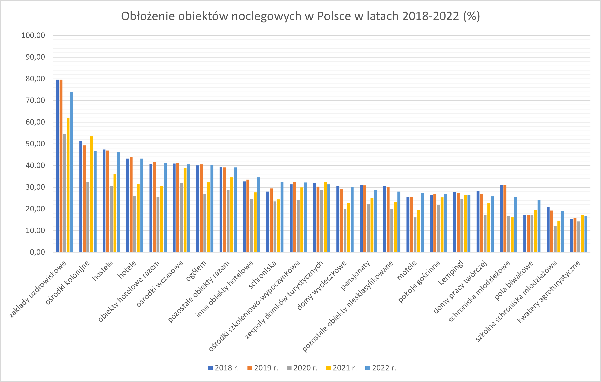
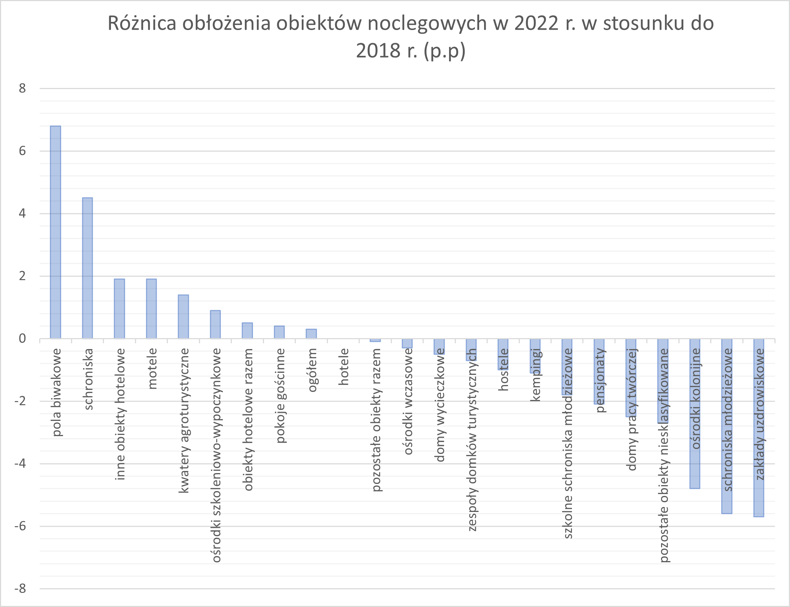
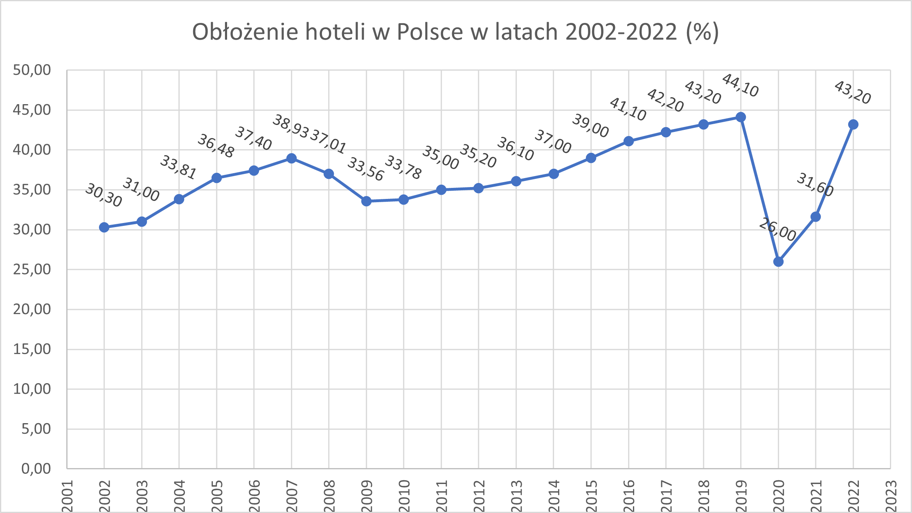
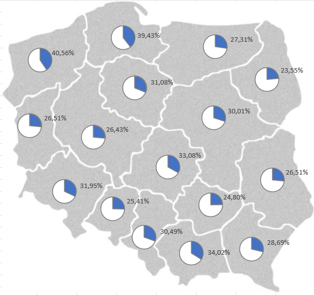

# SQL Project "Accommodation in Poland"

Analysis of statistical data on accommodation in Poland.


## Methodology

Compiling statistical data from the Central Statistical Office from stat.gov.pl and sending queries to the database in pgAdmin 4 (PostgresSQL) in order to perform the following analysis;

## Primary Objective

1. List the occupancy of accommodation hotels in Poland in 2022 r.   
2. List the occupancy rate of each accommodation facility in Poland from 2018 to 2022.    
3. List the difference in the occupancy of accommodation facilities in 2022 compared to 2018. In which facilities has there been an increase?  
4. List the occupancy of all hotels in Poland in the years 2002 - 2022.  
5. List the smallest and largest hotel occupancy in Poland in the years 2002 - 2022.  
6. List the use of accommodation places in each region in 2022 r.  
7. List the type of amenities that are most common in accommodation places and compare the percentage of 2022 to 2002.  


# Creating  
## Creating databases 

```
CREATE DATABASE accommodation_in_poland
    WITH
    OWNER = postgres
    ENCODING = 'UTF8'
    CONNECTION LIMIT = -1
    IS_TEMPLATE = False;
```

## Create and copy tables

#### 1. Create and copy table "St_wykorzystania_miejsc_noclegowych"
```
CREATE TABLE St_wykorzystania_miejsc_noclegowych(
	Kod varchar(10),
	Nazwa varchar(30),
	Rodzaje_obiektów varchar(100),
	Rok INTEGER,
	Wartosc decimal(5,2),
	Jednostka_miary varchar(10),
	Atrybut varchar(10)
);

COPY St_wykorzystania_miejsc_noclegowych
FROM 'D:\project_accommodation_in_poland\St_wykorzystania_miejsc_noclegowych.txt'
WITH (FORMAT CSV, HEADER,DELIMITER ';');
```
#### 2. Create and copy table "placowki_gastronomiczne"
```
CREATE TABLE placowki_gastronomiczne(
		Kod varchar(10),
		Nazwa varchar(30),
		Rodzaje_obiektów varchar(100),
		Rodzaje_placówek varchar(100),
		Rok INTEGER,
		Wartosc INTEGER,
		Jednostka_miary varchar(10),
		Atrybut varchar(10)
	);


COPY placowki_gastronomiczne
FROM 'D:\project_accommodation_in_poland\Placowki_gastronomiczne.txt'
WITH (FORMAT CSV, HEADER,DELIMITER ';');
```
#### 3. Create and copy table "obiekty_z_zapleczem_sportowo_rekreacyjnym"
```
CREATE TABLE obiekty_z_zapleczem_sportowo_rekreacyjnym(
		Kod varchar(10),
		Nazwa varchar(30),
		Rodzaje_urządzeń varchar(100),
		Rok INTEGER,
		Wartosc INTEGER,
		Jednostka_miary varchar(10),
		Atrybut varchar(10)
	);

COPY obiekty_z_zapleczem_sportowo_rekreacyjnym
FROM 'D:\accommodation_in_poland\obiekty_z_zapleczem_sportowo_rekreacyjnym.txt'
	WITH (FORMAT CSV, HEADER,DELIMITER ';');
```
#### 4. Create and copy table "obiekty_z_udogodnieniem_dla_niepełnosprawnych"
```
CREATE TABLE obiekty_z_udogodnieniem_dla_niepełnosprawnych(
		Kod varchar(10),
		Nazwa varchar(30),
		Rodzaje_udogodnień varchar(100),
		Rok INTEGER,
		Wartosc INTEGER,
		Jednostka_miary varchar(10),
		Atrybut varchar(10)
	);

COPY obiekty_z_udogodnieniem_dla_niepełnosprawnych
FROM 'D:\project_accommodation_in_poland\Obiekty_z_udogodnieniem_dla_niepelnosprawnych.txt'
WITH (FORMAT CSV, HEADER,DELIMITER ';');
```
#### 5. Create and copy table "obiekty_z_zapleczem_konferencyjnym"
```
CREATE TABLE obiekty_z_zapleczem_konferencyjnym(
		Kod varchar(10),
		Nazwa varchar(30),
		Zaplecze_konferencyjne varchar(100),
		Rok INTEGER,
		Wartosc INTEGER,
		Jednostka_miary varchar(10),
		Atrybut varchar(10)
	);

COPY obiekty_z_zapleczem_konferencyjnym
FROM 'D:\project_accommodation_in_poland\Obiekty_z_zapleczem_konferencyjnym.txt'
WITH (FORMAT CSV, HEADER,DELIMITER ';');
```
#### 6. Create and copy table "st_wykorzystania_hoteli"
```
CREATE TABLE st_wykorzystania_hoteli(
		Kod varchar(10),
		Nazwa varchar(30),
		Wyszczególnienie varchar(100),
		Kategorie varchar(100),
		Rok INTEGER,
		Wartosc decimal(5,2),
		Jednostka_miary varchar(10),
		Atrybut varchar(10)
	);

COPY st_wykorzystania_hoteli
FROM 'D:\project_accommodation_in_poland\St_wykorzystania_hoteli_wg_kategorii.txt'
WITH (FORMAT CSV, HEADER,DELIMITER ';');
```


# Creating queries

## Select information from tables
### 1. List the occupancy of accommodation hotels in Poland in 2022 r. 

```
SELECT DISTINCT rodzaje_obiektów
FROM St_wykorzystania_miejsc_noclegowych;

SELECT rodzaje_obiektów, wartosc AS "obłożenie_%_2022"
FROM St_wykorzystania_miejsc_noclegowych
WHERE Nazwa = 'POLSKA' AND rok = 2022
ORDER BY wartosc DESC NULLS LAST;
```
#### results:
|    |rodzaje_obiektów        |  obłożenie_%_2022  |
|----|------------------------|--------------------|
|1   |zakłady uzdrowiskowe    |73.90               |
|2   |ośrodki kolonijne       |46.60               |
|3   |hostele                 |46.40               |
|4   |hotele                  |43.20               |
|5   |obiekty hotelowe razem  |41.30               |
--snip--


### 2. List the occupancy rate of each accommodation facility in Poland from 2018 to 2022.  
```
COPY
(SELECT 
	t1.rodzaje_obiektów, 
	t1."obłożenie_%_2018", 
	t2."obłożenie_%_2019",
	t3."obłożenie_%_2020",
	t4."obłożenie_%_2021",
	t5."obłożenie_%_2022"
FROM (SELECT rodzaje_obiektów, wartosc AS "obłożenie_%_2018"
	FROM St_wykorzystania_miejsc_noclegowych
	WHERE Nazwa = 'POLSKA' AND rok = 2018 AND wartosc IS NOT NULL) as t1
	, 
	(SELECT rodzaje_obiektów, wartosc AS "obłożenie_%_2019"
	FROM St_wykorzystania_miejsc_noclegowych
	WHERE Nazwa = 'POLSKA' AND rok = 2019 AND wartosc IS NOT NULL) as t2
	,
	(SELECT rodzaje_obiektów, wartosc AS "obłożenie_%_2020"
	FROM St_wykorzystania_miejsc_noclegowych
	WHERE Nazwa = 'POLSKA' AND rok = 2020 AND wartosc IS NOT NULL) as t3
	,
	(SELECT rodzaje_obiektów, wartosc AS "obłożenie_%_2021"
	FROM St_wykorzystania_miejsc_noclegowych
	WHERE Nazwa = 'POLSKA' AND rok = 2021 AND wartosc IS NOT NULL) as t4
	,
	(SELECT rodzaje_obiektów, wartosc AS "obłożenie_%_2022"
	FROM St_wykorzystania_miejsc_noclegowych
	WHERE Nazwa = 'POLSKA' AND rok = 2022 AND wartosc IS NOT NULL) as t5
WHERE t1.rodzaje_obiektów = t2.rodzaje_obiektów 
		AND t1.rodzaje_obiektów = t3.rodzaje_obiektów
		AND t1.rodzaje_obiektów = t4.rodzaje_obiektów
		AND t1.rodzaje_obiektów = t5.rodzaje_obiektów
ORDER BY "obłożenie_%_2022" DESC
)
TO 'D:\projekt_1\Oblozenie_obiektow_noclegowych_w_2018-2022.csv'
WITH (FORMAT CSV, HEADER, DELIMITER ',');
```
#### results:

| |rodzaje_obiektów        | obłożenie_%_2018|obłożenie_%_2019|obłożenie_%_2020|obłożenie_%_2021| obłożenie_%_2022|
|--|-----------------------|----------------|----------------|----------------|----------------|----------------|
|1 |zakłady uzdrowiskowe   |79.60   |79.60	|54.50	|61.90	|73.90|
|2 |ośrodki kolonijne      |51.40	|49.30	|32.50	|53.50	|46.60|
|3 |hostele                |47.40	|46.90	|30.70	|36.00	|46.40|
|4 |hotele                 |43.20	|44.10	|26.00	|31.60	|43.20|
|5 |obiekty hotelowe razem |40.80	|41.70	|25.50	|30.70	|41.30|

--snip--




###  3. List the difference in the occupancy of accommodation facilities in 2022 compared to 2018. In which facilities has there been an increase? 
```
COPY
(SELECT 
	t1.rodzaje_obiektów, 
	t1."obłożenie_%_2018", 
	t5."obłożenie_%_2018",
	"obłożenie_%_2022" - "obłożenie_%_2018" AS obłożenie_%_2018"
FROM (SELECT rodzaje_obiektów, wartosc AS "obłożenie_%_2018"
	FROM St_wykorzystania_miejsc_noclegowych
	WHERE Nazwa = 'POLSKA' AND rok = 2018 AND wartosc IS NOT NULL) as t1
	,
	(SELECT rodzaje_obiektów, wartosc AS "obłożenie_%_2022"
	FROM St_wykorzystania_miejsc_noclegowych
	WHERE Nazwa = 'POLSKA' AND rok = 2022 AND wartosc IS NOT NULL) as t5
WHERE t1.rodzaje_obiektów = t5.rodzaje_obiektów
ORDER BY "wzrost/spadek (p.p.)" DESC;
)
TO 'D:\projekt_1\Wzrost,spadek_obłożenia.csv'
WITH (FORMAT CSV, HEADER, DELIMITER ',');
```
#### results:
|    |rodzaje_obiektów        | obłożenie_%_2018 |obłożenie_%_2018 |obłożenie_%_2018|
|----|------------------------|------------------|-----------------|----------------|
|1   |pola biwakowe           |17.30	         |24.10	           |6.80            |
|2   |schroniska              |28.00	         |32.50            |4.50            |
|3   |inne obiekty hotelowe   |32.70	         |34.60            |1.90            |
|4   |motele                  |25.50	         |27.40            |1.90            |
|5   |kwatery agroturystyczn  |15.30	         |16.70            |1.40            |

--snip-- 



### 4. List the occupancy of all hotels in Poland in the years 2002 - 2022. 

```
COPY
(SELECT rok, wartosc AS "obłożenie_hoteli_%"
FROM St_wykorzystania_miejsc_noclegowych
WHERE 
	Nazwa = 'POLSKA' AND 
	rodzaje_obiektów ='hotele' AND 
	rok BETWEEN 2002 AND 2022
ORDER BY rok ASC
)
TO 'D:\projekt_1\Oblozenie_hoteli_w_Polsce_w_latach_2002-2022.csv'
WITH (FORMAT CSV, HEADER, DELIMITER ',');
```
#### results:
|    |rok     |obłożenie_hoteli_%  |
|----|--------|--------------------|
|1   |2002    |30.30               |
|2   |2003    |31.00               |
|3   |2004    |33.81               |
|4   |2005    |36.48               |
|5   |2006    |37.40               |
--snip--



### 5. List the smallest and largest hotel occupancy in Poland in the years 2002 - 2022. 

```
SELECT max(wartosc), min(wartosc)
FROM St_wykorzystania_miejsc_noclegowych
WHERE 
	Nazwa = 'POLSKA' AND 
	rodzaje_obiektów ='hotele';
```
#### results:
|    |max     |min     |
|----|--------|--------|
|1   |44.10   |26.00   |


```
SELECT rok, wartosc 
FROM St_wykorzystania_miejsc_noclegowych
WHERE wartosc = (SELECT max(wartosc)
FROM St_wykorzystania_miejsc_noclegowych
WHERE 
	Nazwa = 'POLSKA' AND 
	rodzaje_obiektów ='hotele')
ORDER BY rok;
```
#### results:
|    |rok     |wartosc             |
|----|--------|--------------------|
|1   |2006    |44.10               |
|2   |2008    |44.10               |
|3   |2013    |44.10               |
|4   |2019    |44.10               |
|5   |2022    |44.10               |


```
SELECT rok, wartosc 
FROM St_wykorzystania_miejsc_noclegowych
WHERE wartosc = (SELECT min(wartosc)
FROM St_wykorzystania_miejsc_noclegowych
WHERE 
	Nazwa = 'POLSKA' AND 
	rodzaje_obiektów ='hotele')
ORDER BY rok;
```
#### results:
|    |rok     |wartosc             |
|----|--------|--------------------|
|1   |2002    |26.00               |
|2   |2003    |44.10               |
|3   |2016    |44.10               |
|4   |2008    |44.10               |
|5   |2010    |44.10               |

--snip--

### 6. List the use of accommodation places in each region in 2022 r.  

```
COPY
(SELECT nazwa AS "województwo", round((sum(wartosc)/count(nazwa)),2) AS "wartość (%)"
FROM St_wykorzystania_miejsc_noclegowych
WHERE 
	Nazwa NOT ILIKE 'POLSKA' AND 
	rodzaje_obiektów NOT ILIKE 'ogółem' AND
	rok = 2022 AND
	wartosc IS NOT NULL AND 
	wartosc > 0
GROUP BY nazwa
ORDER BY "wartość (%)" DESC
)
TO 'D:\projekt_1\Wykorzystanie_obiektow_noclegowych_w_wojewodztwach_w_2022.csv'
WITH (FORMAT CSV, HEADER, DELIMITER ',');
```
#### results:
|    |województwo            |wartość (%)    |
|----|-----------------------|---------------|
|1   |ZACHODNIOPOMORSKIE     |40.56          |
|2   |POMORSKIE              |39.43          |
|3   |MAŁOPOLSKIE            |34.02          |
|4   |ŁÓDZKIE                |33.08          |
|5   |DOLNOŚLĄSKIE           |31.95          |

--snip--



### 7. List the type of amenities that are most common in accommodation places and compare the percentage of 2022 to 2002. 

```
SELECT DISTINCT rodzaje_udogodnień
FROM obiekty_z_udogodnieniem_dla_niepełnosprawnych;
```
#### results:
|    |rodzaje_udogodnień                                                  |
|----|--------------------------------------------------------------------|
|1   |pokoje/łazienki przystosowane dla osób niepełnosprawnych            |
|2   |drzwi automatycznie otwierane                                       |
|3   |parking z wyznaczonymi miejscami dla osób niepełnosprawnych ruchowo |
|4   |winda przystosowana dla osób niepełnosprawnych                      |
|5   |pochylnia wjazdowa                                                  |


```
UPDATE obiekty_z_udogodnieniem_dla_niepełnosprawnych
SET rodzaje_udogodnień = 'winda przystosowana dla osób niepełnosprawnych'
WHERE rodzaje_udogodnień = 'winda przystosowana dla osób niepełnosprawnych ruchowo';
```
```
UPDATE obiekty_z_udogodnieniem_dla_niepełnosprawnych
SET rodzaje_udogodnień = 'pokoje/łazienki przystosowane dla osób niepełnosprawnych'
WHERE rodzaje_udogodnień = 'pokoje/łazienki przystosowane dla osób niepełnosprawnych ruchowo (w tym na wózkach inwalidzkich)';
```


```
SELECT 
t1.rodzaje_udogodnień, 
t1."ilość_2021",
t2."ilość_2009",
t1."ilość_2021" - t2."ilość_2009" AS "różnica_ilościowa",
CAST(ROUND(((t1."ilość_2021"::numeric - t2."ilość_2009"::numeric)* 100 )/(t2."ilość_2009"::numeric),2) AS numeric(5,2)) 
AS "różnica_procentowa"
FROM 
	(SELECT rodzaje_udogodnień, sum(wartosc) AS "ilość_2021"
	FROM obiekty_z_udogodnieniem_dla_niepełnosprawnych
	WHERE 
	rok = 2021 
	GROUP BY rodzaje_udogodnień) AS t1
JOIN
	(SELECT rodzaje_udogodnień, sum(wartosc) AS "ilość_2009"
	FROM obiekty_z_udogodnieniem_dla_niepełnosprawnych
	WHERE  
	rok = 2009 
	GROUP BY rodzaje_udogodnień) AS t2
ON t1.rodzaje_udogodnień = t2.rodzaje_udogodnień
ORDER BY "ilość_2021" DESC NULLS LAST;
```
#### results:
|  |rodzaje_udogodnień                                       |ilość_2021 |ilość_2009|ilość_2021|
|--|---------------------------------------------------------|-----------|----------|----------|
|1 |parking z wyznaczonymi miejscami dla osób niepełnosprawnych ruchowo|4678|[null]|[null]|[null]|
|2 |pochylnia wjazdowa                                       |4242	|3612	|630	|17.44     |
|3 |winda przystosowana dla osób niepełnosprawnych           |3634	|1850	|1784	|96.43     |
|4 |motdrzwi automatycznie otwieraneele                      |2538	|1354	|1184	|87.44     |
|5 |pokoje/łazienki przystosowane dla osób niepełnosprawnych |[null]|3626   |[null] |[null]    |

